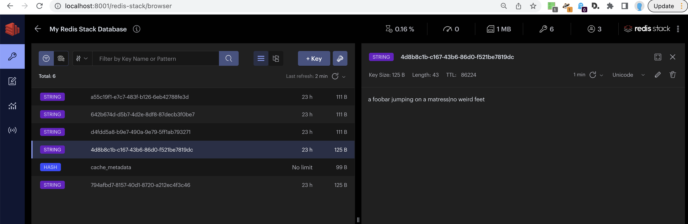

# Simple Stable Diffusion UI

This is an extremely simple [Stable Diffusion](https://huggingface.co/stabilityai/stable-diffusion-2) web based
UI. The UI is using the [fastapi](http://fastapi.tiangolo.com/) microservice framework.
The installation will also install stable-diffusion for you (note that the initial first run might take long because it will download the whole SD model).

It comes with:

* a totally minimalistic UI. Easy enough for anyone to understand the code and for tweaking it and making it prettier (Pull requests welcome!) :-)
* a cache (redis) which saves the prompt, the timestamp and the filename of the generated image

# How to install it?

Run it on a machine with a working NVIDIA based GPU (tested on NVIDIA GeForce RTX 3080 with Driver Version: 520.56.06    CUDA Version: 11.8  , Ubuntu 20.04)

1. git clone it
2. ``pip install -r requirements``
3. Run it: ``uvicorn  --host 0.0.0.0 app:app ``. **Note**: the first time, you run it, this will take long and download large models.

# How to explore the cache?
``ls -al output/`` as well as using redis-cli to explore the prompt which matched a specific file.

Also, you can use redis-insights to graphically explore the filename to prompt mapping

Go to https://localhost:8001/

# How to report bugs?
Please create a pull request and improve.

